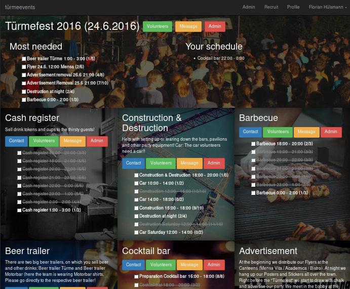

# events

[meteor](https://www.meteor.com/) based events volunteer management platform.

## Screenshot

## Development

See http://guide.meteor.com/

## Deployment

**Important:** when switching from old mupx to mup, you don't have to run setup again. Just init, set up the mup.js and you can deploy.

You can choose from [different deployment methods](http://guide.meteor.com/deployment.html), the recommended is [mup](https://github.com/zodern/meteor-up):

    npm install -g mup
    mkdir events-prod && cd events-prod
    mup init

Example mup.js:

	module.exports = {
		servers: {
			one: {
				host: 'production.meteor.example.com',
				username: 'root',
				pem: '~/.ssh/id_rsa',
			}
		},

		meteor: {
			name: 'events',
			path: '/project/path/events',
			servers: {
				one: {},
			},
			buildOptions: {
				serverOnly: true,
			},
			env: {
				ROOT_URL: 'http://events.example.com',
				MONGO_URL: 'mongodb://localhost/meteor',
				HTTP_FORWARDED_COUNT: 1, // nginx proxy
				MAIL_URL: "smtp://mail.example.com:25/"
			},

			dockerImage: 'abernix/meteord:base',
			deployCheckWaitTime: 300, // the default value didn't work for me
			enableUploadProgressBar: true
		},

		mongo: {
			oplog: true,
			port: 27017,
			version: '3.4.1',
			servers: {
				one: {},
			},
		},
	};

Deploy:

	mup deploy

Backup database:

    ssh root@production.meteor.example.com docker exec mongodb mongodump --archive --db events > backup_events_`date "+%Y%m%d-%H%M"`.dump

Make user a system admin (first argument can be `{}` instead of `{_id: ...}` if there's only one user in the db, otherwise you have to provide a user id):

    ssh root@production.meteor.example.com
    docker exec -it mongodb mongo events
    db.users.update({_id:"GQ4fy3aRrBQfFqD6h"}, {$set: {roles: {__global_roles__: ["system_admin"]}}});

This user can then use the web GUI to set other system or event admins and create events. S.b. for details on access roles used in this project.

## Mobile app
Information on how to build the Cordova-based Android and iOS app can be found [here](https://guide.meteor.com/mobile.html). Remember that you need to pass the `--server <host>:<port>` parameter to the `meteor build` command (or `--mobile-server` to the `meteor run` command) if you want the app to connect to a running production server.

## Roles
This project uses the meteor package [alanning:roles](https://atmospherejs.com/alanning/roles). Check out its documentation and examples first!

### System admins

**role:** `__global_roles__: ["system_admin"]`

* add and remove system admins
* create and remove events
* add and remove event admins
* most operations from the other roles (forgot to document it)

### Event admins

**role:** `event_id: ["event_admin"]`

* add and remove event admins
* manage the event, i.e. change properties
* send emails to all volunteers of this event
* create and remove event tasks
* add and remove task admins
* add and remove event coordinators

*Users added as event admins in the web UI automatically become event coordinators as well*

### Task admins

**role:** `task_id: ["task_admin"]`

* add and remove task admins
* manage the task, i.e. change properties
* send emails to all volunteers of this task
* create, remove and modify time slots
* manage volunteers for this task, i.e. list and check in the volunteers

*Users added as task admins in the web UI automatically become event coordinators as well*

### Event coordinators

**role:** `event_id: ["coordinator"]`

* add and list volunteers
